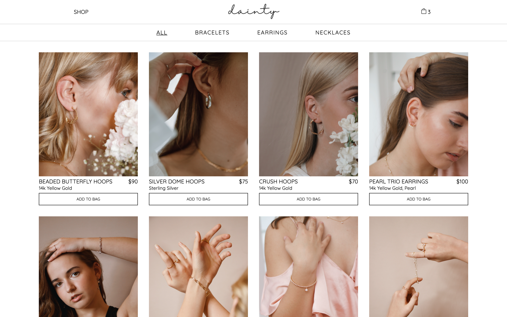
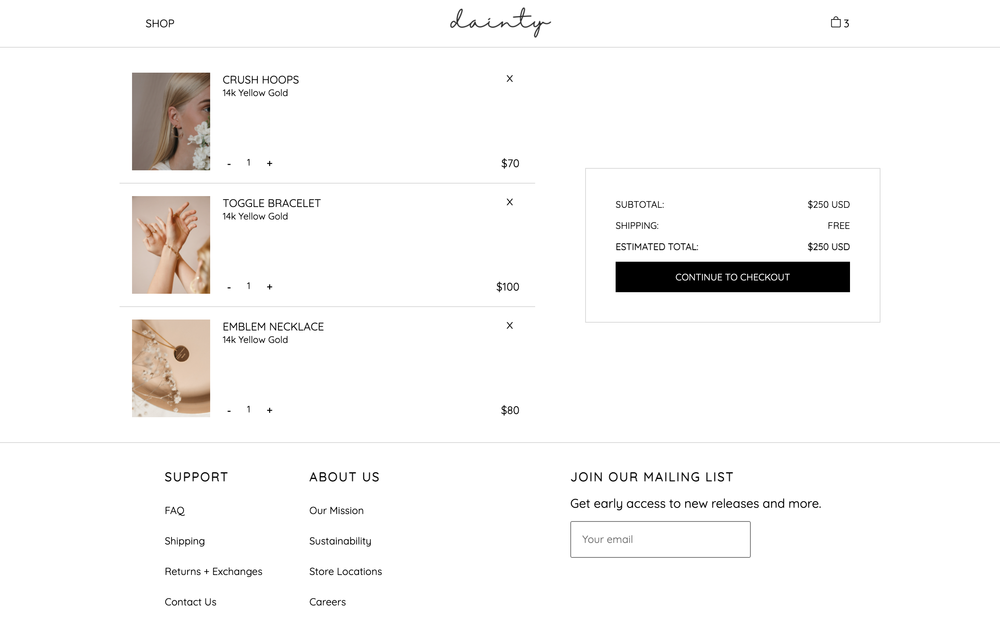

# 💍 Dainty
Dainty is a mock e-commerce jewelry site with a fully functional shopping cart, made with React.

[Live demo](https://kwen0.github.io/shopping-cart/)

## Screenshots
### Home Page


### Products Page


### Shopping Cart


## Features
- Browse products by category
- Add products to cart, remove them, or edit the quantity
- Clean, responsive UI design

## Tools Used
- React.js (react-router)
- Javascript, CSS

## Getting Started
```
$ git clone git@github.com:kwen0/shopping-cart.git
cd shopping-cart
npm install
npm start
```

## Future Features
- Allow user to search products
- Allow user to sort products by price or by material
- Add to wishlist functionality
- Implement mobile friendliness

## Attributions
- Photos by [Joeyy Lee](https://unsplash.com/@joeyy_anne), [Jasmin Chew](https://unsplash.com/@majestical_jasmin), [Nati Melnychuk](https://unsplash.com/@natinati), [Kate Hliznitsova](https://unsplash.com/@kate_gliz), and [Mariana Beltrán](https://unsplash.com/@ostranenie) on [Unsplash](https://unsplash.com/)

